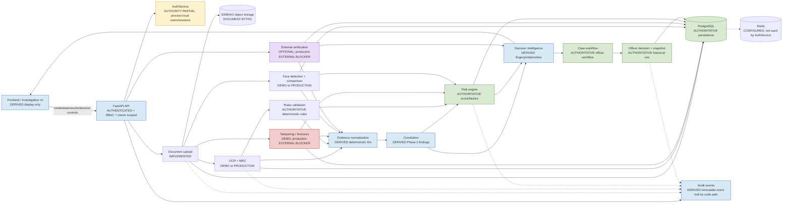

# TrustID Phases 1–6 Cross-Phase Integration & Architecture Audit

**Repository:** `gulshanverse/TrustID-Smart-Identity-Verification-System`  
**Audited HEAD:** `5ccfba067189e8f2a492bb5d8b6e27dbe5113a7d`  
**Branch:** `main`  
**Audit mode:** Read-only. No product code, thresholds, models, infrastructure, or behavior was changed during this audit. Phase 7 was not started.

## A. Repository synchronization

The initial audit checkout was clean and synchronized with GitHub. `HEAD`, `origin/main`, and the required audit commit are identical. The only current untracked path is this newly created audit report artifact.

| Check | Result |
|---|---|
| `git status` | Initial audit state clean; final state has only this untracked report artifact |
| Branch | `main` |
| `git rev-parse HEAD` | `5ccfba067189e8f2a492bb5d8b6e27dbe5113a7d` |
| `git rev-parse origin/main` | `5ccfba067189e8f2a492bb5d8b6e27dbe5113a7d` |
| Required HEAD | `5ccfba067189e8f2a492bb5d8b6e27dbe5113a7d` |
| Equality | All three match |

Last five commits:

```text
5ccfba0 (HEAD -> main, origin/main, origin/HEAD) Repair Phase 6 decision integrity
ed3bfec Implement phase 6 decision intelligence
0dbafb7 Implement phase 5 rules and external verification
8ba96a7 feat: add verification evidence correlation engine
f30cbc8 fix: align phase 2 production face configuration and result semantics
```

## B–G. Phase inventory

The status labels below are based on source inspection, not documentation claims.

| Phase | Area | Status | Evidence and boundary |
|---|---|---|---|
| 1 | OCR abstraction and demo/production providers | IMPLEMENTED | `app/domain/ocr.py`, `api/v1/ocr.py`, and `services/ocr_service.py` expose `OCRProvider`, `DemoOCRProvider`, and `ProductionOCRProvider`. Selection is configuration-driven; provider and version are persisted. |
| 1 | MRZ parsing and field comparison | IMPLEMENTED | `app/domain/mrz.py` parses TD3 MRZ data, validates checksums, and compares normalized OCR fields. |
| 1 | Document quality and upload validation | IMPLEMENTED | `document_quality.py` bounds image pixels/PDF pages; `documents.py` validates size, extension, MIME, and magic signatures. |
| 1 | OCR persistence/API/frontend | IMPLEMENTED | OCR result, fields, evidence, audit metadata, API response, and verification UI are present. |
| 1 | Durable production auth/session integration | PARTIAL | Auth/session authority is in `AuthService` process memory, while database users and Redis settings also exist. See P1 finding F-01. |
| 2 | Face detection, quality gate, alignment, embedding, similarity | IMPLEMENTED | `domain/face.py` contains detector selection, quality gates, alignment/crop paths, normalized embeddings, similarity, and threshold/review bands. A process-global inference lock serializes inference. |
| 2 | Configured face provider boundary | IMPLEMENTED | `api/v1/face.py` selects demo or production and propagates model/detector paths, hashes, thresholds, and quality settings. |
| 2 | Liveness/PAD | EXPECTED LIMITATION | Explicitly represented as `NOT_IMPLEMENTED`/missing information; no liveness claim is made. |
| 2 | Production biometric validation/legal/fairness evidence | EXTERNAL BLOCKER | Requires authorized models, datasets, hardware, deployment, calibration, provenance review, and governance evidence. |
| 3 | Normalized evidence and deterministic evidence IDs | IMPLEMENTED | `domain/evidence.py` creates normalized evidence and UUID5 identifiers scoped to verification/source keys. |
| 3 | Correlation, findings, provenance, risk references | IMPLEMENTED | `correlate()` links findings to evidence IDs and carries module/provider/version/rule provenance. |
| 3 | Signal versus contradiction distinction | IMPLEMENTED | Cross-source mismatches are contradictions; face no-match and tampering are signals. Phase 6 consumes correlation output. |
| 3 | Durable evidence/audit persistence | PARTIAL | Result objects and audit links are persisted through module repositories, but there is no single persisted correlation-result table; correlation is reconstructed from latest module rows. |
| 4 | Metadata/JPEG/PDF forensic analysis | IMPLEMENTED | `services/forensics.py` and tampering domain/provider implement bounded forensic signals and findings. |
| 4 | Production forensic resources and validation | EXTERNAL BLOCKER | No production deployment/ground-truth benchmark evidence is present in this repository. |
| 5 | Deterministic rules and rule metadata | IMPLEMENTED | `RulesEngine` in `domain/rules.py` is the rule authority; rule IDs/versions/observed/expected fields are persisted. |
| 5 | External status model and normalized persistence | IMPLEMENTED | `ExternalStatus`, `ExternalVerificationModel`, migration 012, and latest-result reuse are present. |
| 5 | Authorized production external provider | EXTERNAL BLOCKER | `ProductionExternalVerificationProvider` truthfully returns `NOT_AVAILABLE` when unconfigured; no government database is connected. |
| 5 | Demo/production separation | PARTIAL | OCR and face select configured providers. Tampering currently supports only the demo provider and returns unavailable for another configured mode. This is explicit, not a silent demo fallback. |
| 6 | Evidence summary, priorities, missing information, provenance | IMPLEMENTED | `DecisionIntelligenceService` builds these from normalized evidence and persisted risk. |
| 6 | Analysis fingerprint and generated-at separation | IMPLEMENTED | `analysis_fingerprint` excludes `generated_at` and is regression-tested. |
| 6 | Historical officer snapshot | IMPLEMENTED | `CaseDecisionModel.decision_context`, `decision_snapshot()`, repository persistence, and migration 013 are present. |
| 6 | Partial evidence in Decision Intelligence | IMPLEMENTED | Phase 6 API creates deterministic unavailable-state representations for missing optional module rows; source-of-truth and risk are still required. |
| 6 | Concurrent idempotency guarantees | PARTIAL | Current duplicate prevention uses application-level select-then-insert without database uniqueness. See P1 finding F-02. |

## H. End-to-end pipeline result

The logical golden path is coherent for a complete demo analysis, with the following actual handoffs:

| Transition | Produced object / persistence | Consumer and link | Availability and provenance assessment |
|---|---|---|---|
| Authentication | `AuthUser` and process-local session token; database user records also exist | `get_current_user()` and `require_permission()` consume the cookie | Authenticated/RBAC/owner checks are present, but session durability is process-local (F-01). |
| Verification creation | `VerificationModel` / `VerificationRecord` | Document upload uses `verification_id` | Owner FK and owner-scoped lookup are present. |
| Document upload | `DocumentModel`, object-storage object, `DOCUMENT_UPLOADED` audit event | OCR, tampering, face, and analysis use `document_id` | Server-generated storage key, size/MIME/magic validation, and cleanup-on-metadata-failure are present. |
| OCR | `OCRResultModel`, `OCRFieldModel`, OCR evidence, audit event | Validation, correlation, risk use OCR result ID/document ID | Demo/production provider and version are preserved. OCR raw text is exposed to authorized API consumers by design; logs use safe exception messages. |
| MRZ | Embedded/persisted OCR `mrz` JSON and field consistency | Correlation compares OCR/MRZ normalized values | Checksum and mismatch semantics are present. |
| Validation | `DocumentValidationModel` and findings | Risk and Decision Intelligence use latest validation by document ID | Rules are authoritative. Validation is generated by the deterministic Phase 5 rules adapter. |
| Tampering | `TamperingResultModel`, finding/evidence children, audit event | Correlation and risk use result ID/document ID | Technical signal remains a signal, not proof of fraud. Provider metadata is retained. |
| Face | `FaceVerificationModel` and evidence children | Correlation and risk use result ID/document/verification IDs | Presented face is processed in memory and not retained by the service; provider/model version is exposed. |
| External verification | `ExternalVerificationModel` | Decision Intelligence loads latest result by verification ID | Production unconfigured state is `NOT_AVAILABLE`; demo status is labeled and persisted. Existing-result reuse is implemented. |
| Evidence normalization | In-memory `EvidenceItem`/`VerificationFinding` values | Correlation and API response | Evidence IDs are deterministic UUID5 values; normalized correlation is reconstructed rather than independently persisted. |
| Correlation | `CorrelationResult` in orchestration and API result | Risk and Phase 6 consume it | No duplicate risk scoring is performed by correlation or Phase 6. |
| Risk | `RiskAssessmentModel` plus `RiskFactorModel` and audit event | Phase 6 and frontend display latest persisted assessment | `assess_risk()` is the sole score calculator found. Phase 6 presents, rather than recalculates, risk. |
| Decision Intelligence | `DecisionIntelligenceResult`, including fingerprint | GET/POST decision-intelligence APIs and officer decision path | Generated time is metadata; deterministic content is fingerprinted. |
| Case | `CaseModel`, case evidence/notes/timeline | Officer decision route | Case is linked to verification and owner/assignment visibility rules. |
| Officer decision | `CaseDecisionModel`, `decision_context`, `CASE_DECISION_RECORDED` | Historical decision and case status | APPROVE/REVIEW/REJECT semantics are preserved. Concurrent duplicate decisions remain possible without a DB uniqueness constraint (F-02). |
| Audit | `AuditEventModel` | Audit API/timeline | Major pipeline transitions are audited. Decision Intelligence completion uses a race-prone application check (F-02). |

### Broken or implicit handoffs

1. `VerificationAnalysisService.analyze()` requires completed OCR, an existing tampering row, and an existing face row before analysis (`services/verification_analysis.py:63–74`). This conflicts with Phase 6’s partial-evidence behavior, which can represent missing optional rows. The Phase 6 endpoint is resilient, but the main `/analyze` and `/result` pipeline remains strict. This is **P2 functional inconsistency F-03**, not a security bypass.
2. Correlation is not stored as a first-class database result. It is reproducible from latest module records, but “latest” selection and source-state mutation are implicit rather than represented by a correlation snapshot. Phase 6 fingerprints the reconstructed result and officer decisions snapshot the resulting context.
3. Auth/session state is not handed off to the configured Redis/database persistence layer. This is F-01.

## I. Cross-phase findings

### F-01 — Process-local authentication/session authority

- **Classification:** P1 — architectural correctness/security boundary issue.
- **Files/functions:** `apps/api/app/services/auth_service.py:AuthService`; `apps/api/app/api/dependencies.py`; `apps/api/app/core/config.py:Settings`.
- **Evidence:** `AuthService` stores `_users` and `_sessions` in dictionaries. `REDIS_URL` is configured but not consumed by the authentication/session implementation. Database user models exist separately.
- **Impact:** A multi-worker or restarted deployment does not have a single durable session/user authority. Sessions can disappear on restart and are not shared between workers. This can cause authentication inconsistency and is not a coherent production cross-phase architecture.
- **Recommended fix:** Choose one authoritative durable identity/session design, preferably database-backed users plus shared Redis/session storage or a signed, revocable durable session mechanism. Add multi-process/restart tests. Do not silently retain the current in-memory authority for production.
- **Blocks Phase 7:** Yes, until production authentication/session architecture is explicitly accepted and validated.

### F-02 — Select-then-insert idempotency races

- **Classification:** P1 — data-integrity issue.
- **Files/functions:** `apps/api/app/api/v1/decision_intelligence.py:161–180`; `apps/api/app/repositories/case_repository.py:128–146`; migration 007/013 schema.
- **Evidence:** Decision Intelligence checks for an existing `DECISION_INTELLIGENCE_COMPLETED` audit row, then inserts if none exists. Officer decisions check for an existing `CaseDecisionModel`, then insert. There is no database unique constraint for `(verification_id, actor_id, event_type)` or one-decision-per-case.
- **Impact:** Concurrent requests can both pass the check and create duplicate completion audit events or multiple officer decisions. This violates the stated “at most one”/single-decision semantics under concurrency.
- **Recommended fix:** Add database uniqueness constraints or transactional locking with conflict handling, then test concurrent POSTs against PostgreSQL. Preserve the existing semantic behavior for ordinary sequential requests.
- **Blocks Phase 7:** Yes, because historical decision integrity and audit idempotency are cross-phase integrity guarantees.

### F-03 — Partial-evidence semantics are not consistent across entry points

- **Classification:** P2 — functional issue.
- **Files/functions:** `apps/api/app/services/verification_analysis.py:63–74`; `apps/api/app/api/v1/intelligence.py:latest_result`; `apps/api/app/api/v1/decision_intelligence.py:53–65`.
- **Evidence:** The Phase 6 endpoint creates deterministic `NOT_AVAILABLE` objects for missing OCR/validation/tampering/face rows, but the primary analysis endpoint fails unless OCR is completed and tampering/face rows exist. The latest result endpoint also returns 404 if any module row is absent.
- **Impact:** Users receive different behavior depending on endpoint: Decision Intelligence can explain partial evidence while the main verification result cannot. This is an implicit broken handoff and makes “available evidence + unavailable modules” non-uniform.
- **Recommended fix:** Define one explicit lifecycle policy and apply it consistently. If partial analysis is supported, persist explicit unavailable result records or make all consumers use the same normalized availability contract. Do not fabricate timestamps or successful results.
- **Blocks Phase 7:** Yes for a coherent pipeline, unless explicitly accepted as an intentional API distinction.

### F-04 — Tampering provider is not production-capable

- **Classification:** EXPECTED LIMITATION / EXTERNAL BLOCKER.
- **Files/functions:** `apps/api/app/api/v1/tampering.py:33–39`; `domain/tampering.py`.
- **Evidence:** The route only constructs `DemoTamperingProvider`; any configured non-demo value returns `503`. No silent demo fallback is present.
- **Impact:** Production tampering analysis is unavailable. This is truthful behavior and not a security defect, but it blocks production verification.
- **Recommended fix:** Integrate and authorize a real bounded provider, with provenance, deployment, and ground-truth validation. Do not label demo output as production.
- **Blocks Phase 7:** External blocker; yes for production claims, not for repository audit correctness.

## J. Security findings

### Positive controls verified

- Protected routes use authenticated dependencies and explicit permissions.
- Verification/document lookups are owner-scoped in repositories and route services.
- Cross-owner document/verification access is covered by tests and returns not-found behavior.
- Upload validation checks content size, extension/MIME consistency, and magic signatures; object keys are server-generated.
- Face upload has a separate 5 MB read limit; face input is processed in memory and not retained by `FaceVerificationService`.
- Production object storage initialization fails closed rather than falling back to local unavailable storage.
- No arbitrary external URL is accepted; the external provider uses structured request fields and the production adapter performs no network fallback.
- Raw provider payloads, biometric embeddings, and images are not included in Phase 6 snapshots. Provider secrets are not returned by API schemas.
- Logs use safe exception messages and do not intentionally log raw face images or embeddings.
- Frontend displays backend risk/evidence/decision-intelligence data and keeps officer buttons separate; it does not calculate authenticity, fraud, or risk locally.

### Residual security/architecture observations

- F-01 is the principal authentication architecture concern.
- Production defaults in `Settings` are local/demo-oriented, but production validation rejects localhost/default object-storage credentials and requires secure cookies. Deployment must still supply explicit values.
- `AuthService` seeds demo users if `DEMO_PASSWORD` is configured; this is appropriate for a demo boundary but must not be enabled unintentionally in production.
- API middleware enables `/docs` and `/redoc` by default. This is not an authorization bypass for protected data, but production exposure should be an explicit deployment decision.

## K. Data-integrity findings

- **Authoritative risk:** `domain/risk.py:assess_risk()` is the only score calculator located. Risk is persisted in `risk_assessments` and factors; Phase 3 references contributions and Phase 6 presents the persisted result. No duplicate Phase 6 weights were found.
- **Authoritative validation:** `RulesEngine` plus `DocumentValidationProvider` adapter. Rule metadata is persisted. No frontend rule interpretation was found.
- **Authoritative Decision Intelligence:** `DecisionIntelligenceService.build()` constructs the derived Phase 6 result from normalized evidence and persisted risk.
- **Authoritative officer decision:** `CaseDecisionModel` and `SqlAlchemyCaseRepository.decision()` preserve APPROVE/REVIEW/REJECT semantics. F-02 means the authority is not concurrency-safe.
- **Historical snapshot:** `decision_context` contains version, fingerprint, risk context/factors, evidence IDs, correlation codes, priorities, missing information, and provenance. It excludes raw images, embeddings, raw provider payloads, secrets, and unnecessary PII. Regeneration does not update the stored row in the normal code path. There is no DB-level immutability trigger; protection is by schema/API write-path design and absence of an update operation.
- **Determinism:** UUID5 evidence/unavailable IDs and sorted evidence/priorities/factors support reproducibility. `generated_at`, provider response timestamps, and ordinary result timestamps are execution metadata and are excluded from the Phase 6 fingerprint. The fingerprint regression tests pass.

## L. Migration findings

Static inspection confirms a linear chain:

```text
001 → 002 → 003 → 004 → 005 → 006 → 007 → 008 → 009 → 010 → 011 → 012 → 013
```

Migration 013 adds nullable JSON `case_decisions.decision_context` and has `down_revision = 012_external_verification_results`. It does not conflict with the earlier case-decision table and introduces no foreign key/index requirement for the JSON payload.

**DATABASE EXECUTION NOT VERIFIED.** Local PostgreSQL was unavailable during repository work, so Alembic migrations were not executed against a live database. The migration chain and declarations were inspected statically only, as required.

## M. Performance and resource findings

### Controls present

- Uploads are limited to 10 MiB.
- Image quality rejects images over 25 million pixels.
- PDFs are limited to five pages for quality/OCR processing.
- Presented face uploads are limited to 5 MiB.
- External timeout setting is bounded to 1–60 seconds, although the current production adapter performs no network request.
- Face inference uses a process-global `RLock`, preventing concurrent model inference in one process.
- Face models are cached/configured once through `@lru_cache(maxsize=1)`.
- Tampering and forensic inputs enforce the document byte limit.

### Limitations

- These are code-level bounds, not production capacity or latency validation. No production benchmark, memory profile, fairness study, or concurrency test was performed.
- The process-global face lock serializes inference and may limit throughput; sizing and multi-worker behavior require deployment validation.
- Auth in-memory state is not suitable for horizontal scaling (F-01).

## N. Test coverage audit

Latest local evidence:

| Suite/check | Result |
|---|---:|
| Backend pytest | 94 passed, 2 skipped |
| Ruff | Passed |
| MyPy | Passed; 68 source files |
| Python compile | Passed |
| Frontend Vitest | Passed; 4 tests |
| Frontend typecheck | Passed |
| Frontend production build | Passed |
| Migration chain | Static inspection passed; live DB execution not verified |

Covered areas include authentication/RBAC, owner scoping, upload validation, storage cleanup, OCR, face, tampering, validation/risk orchestration, evidence correlation, Phase 5 rules, Phase 6 fingerprints/snapshot semantics, cases, and frontend smoke/dashboard behavior.

Important gaps:

1. No PostgreSQL-backed migration execution in this audit environment.
2. No concurrent Decision Intelligence POST test.
3. No concurrent officer-decision test proving one-decision semantics under database isolation.
4. No multi-worker/restart authentication/session test.
5. No full live HTTP golden-path test spanning all persisted providers and the frontend.
6. No production OCR, forensic, face-model accuracy, liveness/PAD, demographic, or external-database validation.
7. Phase 6 partial-evidence domain coverage is present, but complete endpoint-level coverage for each missing persisted module is limited.

## O. External blockers

- Authorized government/external database credentials, allowlist, legal basis, provider SLA, and production security review.
- Production tampering/forensic provider and benchmark ground truth.
- Production OCR deployment resources and operational testing.
- Authorized face models, detector/model provenance, real capture hardware, liveness/PAD, cross-dataset validation, threshold calibration, and demographic/fairness evidence.
- Live PostgreSQL/Redis/object-storage deployment validation.
- Production authentication/session architecture decision and multi-worker validation.

## P. Phase 7 blockers

Phase 7 must not start. Before it can start, the project should resolve or explicitly accept:

1. F-01 durable/shared authentication and session authority.
2. F-02 database-enforced idempotency and concurrency-safe officer decisions/audit completion.
3. F-03 coherent partial-evidence behavior across analysis/result/Decision Intelligence endpoints.
4. Live PostgreSQL migration execution and production deployment validation.
5. External blockers listed above, if Phase 7 would make production or identity-verification claims.

## Q. Recommended fixes ordered by severity

| Order | Finding | Classification | Recommendation |
|---:|---|---|---|
| 1 | F-01 | P1 | Establish durable shared authentication/session authority; validate restart and multi-worker behavior. |
| 2 | F-02 | P1 | Add database uniqueness/locking and concurrency tests for Decision Intelligence completion and case decisions. |
| 3 | F-03 | P2 | Align analysis/result/Decision Intelligence availability semantics without inventing successful or timestamped evidence. |
| 4 | Migration execution | EXPECTED LIMITATION | Run Alembic upgrade/downgrade checks against a disposable PostgreSQL instance. |
| 5 | Production providers | EXTERNAL | Complete authorized provider, deployment, accuracy, liveness, and governance validation. |

## R. Final architecture diagram

The authoritative/derived/optional/demo/production/external-blocker labels are embedded in the diagram.



## S. Overall status

# CROSS-PHASE AUDIT BLOCKED

The complete Phase 1–6 codebase is substantially integrated and the local automated suite is green, but P1 correctness/integrity findings remain: process-local authentication/session authority and race-prone application-only idempotency for audit completion/officer decisions. A P2 partial-evidence handoff inconsistency also remains. Under the supplied rule, an audit with an unresolved P0/P1 correctness or security issue cannot be called passed.

No fixes were implemented during this audit. No Phase 7 work was started.

## Audit boundary

This report distinguishes repository-local evidence from production validation. Passing local tests does not establish production latency, biometric accuracy, forensic accuracy, fairness, legal authority, external database truth, or deployment security.

## T. Remediation follow-up

After the audit, the repository-local P1/P2 findings were remediated in the working tree: API authentication now uses database-backed users and expiring sessions, migration 014 adds durable session storage and database-enforced idempotency indexes, and analysis/result endpoints share explicit unavailable-module constructors. Regression coverage was added for session reconstruction and partial-evidence analysis. Backend validation now reports **95 passed, 2 skipped**, with Ruff, MyPy, and compilation passing; frontend tests/typecheck/build also pass. Live PostgreSQL migration execution and production provider validation remain deployment-stage checks.
